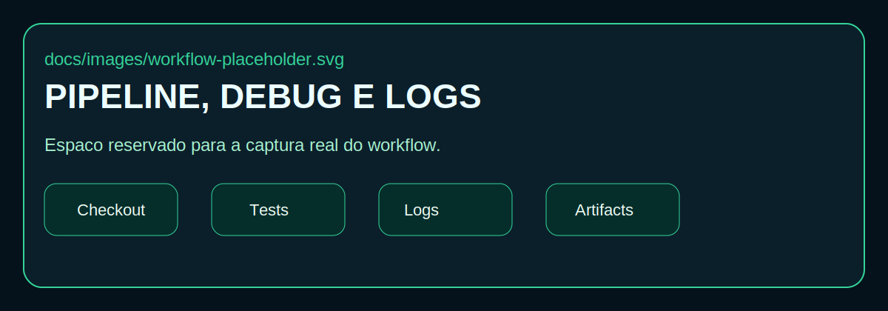

# data-quality-api-github-actions-lab

> Laboratório profissional para demonstrar CI/CD observável, debug de pipelines, service containers e evidências práticas com FastAPI, React/Vite e PostgreSQL.


<a id="indice"></a>

## Índice

- [Objetivo](#objetivo)
- [Arquitetura](#arquitetura)
- [Tecnologias](#tecnologias)
- [Como rodar](#como-rodar)
- [Workflows](#workflows)
- [Debug e logs](#debug-e-logs)
- [Service containers](#service-containers)
- [Status badge](#status-badge)
- [Evidências visuais](#evidencias-visuais)
- [Troubleshooting](#troubleshooting)
- [Próximos passos](#proximos-passos)

<a id="objetivo"></a>

## Objetivo

Este repositório nasce como um laboratório de referência para demonstrar boas práticas de Engenharia de Dados, DevOps e CI/CD com foco em observabilidade. A proposta é evoluir uma aplicação simples, mas com pipelines ricos em logs, rastreabilidade, diagnóstico e evidências visuais para portfólio técnico.

Os principais temas previstos nesta trilha são:

- debug e leitura de logs no GitHub Actions
- métricas e insights sobre execuções
- uso de status badge
- job rodando em ambiente Ubuntu 22.04
- PostgreSQL como service container
- backend com FastAPI
- frontend com Node.js + React/Vite
- testes automatizados com evidências publicáveis

[⬆️ Retornar ao índice](#indice)

<a id="arquitetura"></a>

## Arquitetura

O laboratório será organizado para manter separação clara entre aplicação, banco, automação e documentação. A base inicial já prepara backend, frontend, banco, scripts e espaço dedicado para troubleshooting e evidências.


Detalhes iniciais em [docs/architecture.md](docs/architecture.md).

[⬆️ Retornar ao índice](#indice)

<a id="tecnologias"></a>

## Tecnologias

| Camada | Tecnologia | Papel no laboratório |
| --- | --- | --- |
| Backend | FastAPI | API base para healthcheck, testes e integração |
| Frontend | Node.js + React/Vite | Interface simples para consumir a API |
| Banco | PostgreSQL | Base relacional para cenários locais e service container |
| CI/CD | GitHub Actions | Pipelines, debug, logs, artefatos e badge |
| Containers | Docker Compose | Ambiente local rápido para desenvolvimento |
| Testes | Pytest | Validação automatizada do backend |

[⬆️ Retornar ao índice](#indice)

<a id="como-rodar"></a>

## Como rodar

Nesta etapa, o repositório foi preparado apenas com estrutura e arquivos-base. O fluxo local previsto começará assim:

1. Copiar `.env.example` para `.env`.
2. Subir o PostgreSQL local com `docker compose up -d postgres`.
3. Consultar o status com `make ps`.
4. Evoluir backend, frontend e workflows nas próximas iterações.

Arquivos de apoio:

- `docker-compose.yml`
- `Makefile`
- `backend/requirements.txt`
- `frontend/package.json`

[⬆️ Retornar ao índice](#indice)

<a id="workflows"></a>

## Workflows

O diretório `.github/workflows/` foi preparado para receber pipelines com foco em:

- execução de testes automatizados
- coleta de logs e artefatos
- uso de service containers
- diagnóstico de falhas e troubleshooting
- publicação de badge de status

Nesta fase ainda não existe workflow implementado. O espaço foi criado para evolução incremental e rastreável.

[⬆️ Retornar ao índice](#indice)

<a id="debug-e-logs"></a>

## Debug e logs

Um dos objetivos centrais deste laboratório é tratar o pipeline como fonte de observabilidade, não apenas como automação. A documentação inicial cobre os pontos que receberão mais atenção:

- logs de execução do GitHub Actions
- debug habilitado por variáveis de ambiente
- leitura de artifacts e job summaries
- organização de evidências para portfólio

Guia inicial em [docs/github-actions-debug-logs.md](docs/github-actions-debug-logs.md).



[⬆️ Retornar ao índice](#indice)

<a id="service-containers"></a>

## Service containers

O projeto foi pensado para demonstrar duas camadas complementares:

- PostgreSQL local com Docker Compose para desenvolvimento
- PostgreSQL como service container em GitHub Actions para testes e validação em pipeline

Visão inicial em [docs/service-containers.md](docs/service-containers.md).

[⬆️ Retornar ao índice](#indice)

<a id="status-badge"></a>

## Status badge

O README já está pronto para receber um badge real do GitHub Actions assim que o primeiro workflow for criado. Até lá, os badges acima funcionam como placeholders visuais do laboratório.

Exemplo futuro:

```md

```

[⬆️ Retornar ao índice](#indice)

<a id="evidencias-visuais"></a>

## Evidências visuais

Esta seção foi preparada para receber prints reais das execuções, resultados e artefatos do laboratório.


Arquivos planejados em `docs/images/`:

- `pipeline-summary.png`
- `service-container-postgres.png`
- `tests-and-artifacts.png`
- `status-badge.png`

Organização complementar em [docs/evidence.md](docs/evidence.md).

[⬆️ Retornar ao índice](#indice)

<a id="troubleshooting"></a>

## Troubleshooting

O repositório também já reserva espaço para registrar incidentes, causas prováveis e ações corretivas. Isso ajuda a transformar falhas de pipeline em material de aprendizado e portfólio.

Referência inicial:

- [docs/troubleshooting.md](docs/troubleshooting.md)
- `docs/troubleshooting/`

[⬆️ Retornar ao índice](#indice)

<a id="proximos-passos"></a>

## Próximos passos

As próximas iterações naturais deste laboratório são:

1. criar o primeiro workflow de CI com logs básicos
2. adicionar um endpoint simples no FastAPI
3. iniciar o frontend React/Vite com tela mínima
4. conectar testes unitários e de integração
5. publicar evidências visuais reais no diretório `docs/images`

[⬆️ Retornar ao índice](#indice)
